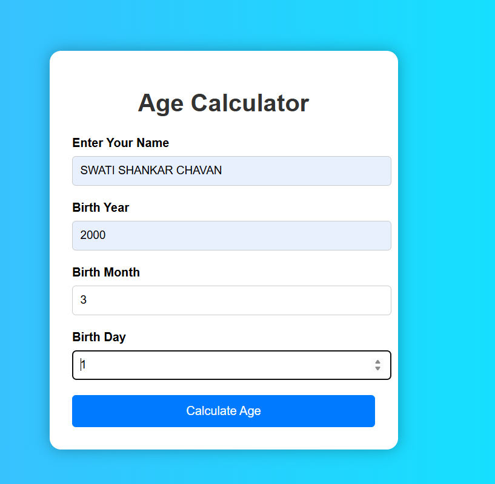
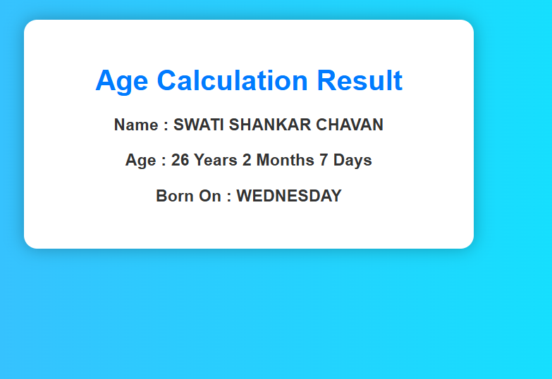

# Age Calculator

## Student Details

| Field | Details |
|-------|---------|
| Name | Swati Chavan |
| USN | 2BL23CS169 |
| Subject | Advanced Java Programming |
| Problem No | 17 |

---

## Project Description

This is a Professional Age Calculator web application developed using Java Servlets, HTML, and CSS.

The application calculates:
- Exact age in years, months, and days
- Day of birth

---

## Technologies Used

- Java
- HTML
- CSS
- Java Servlet
- Apache Tomcat 10
- Eclipse IDE

---

## Folder Structure

```text
src/
WebContent/
screenshots/
README.md
```

---

## How to Run

1. Import project into Eclipse
2. Configure Apache Tomcat Server
3. Run project on server
4. Open browser:

http://localhost:8080/2BL23CS169-AgeCalculator/index.html

---

## Screenshots

### Input Page



### Output Page


